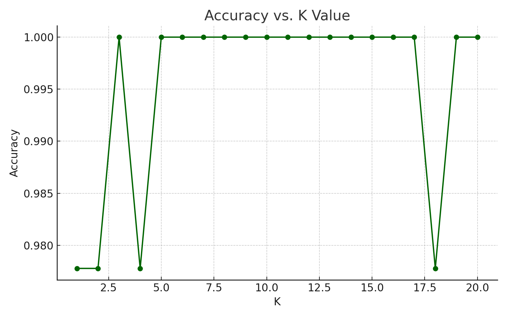
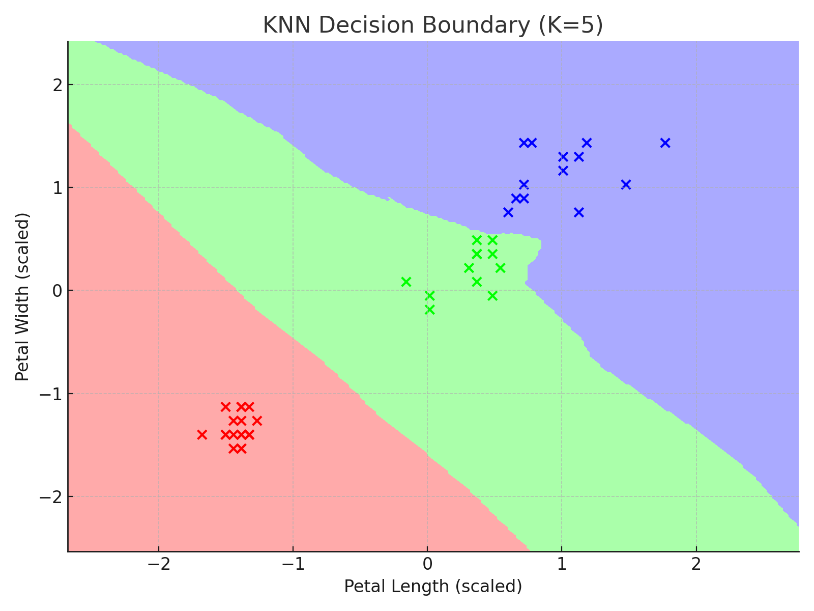

# Day-6-internship-task6
 This repository contains the implementation of the **K-Nearest Neighbors (KNN)** classification algorithm using the classic **Iris dataset**.
# 🌸 KNN Classification on Iris Dataset | AI-ML Internship Task 6

This repository contains the implementation of the **K-Nearest Neighbors (KNN)** classification algorithm using the classic **Iris dataset**.

## ✅ Objectives
- Apply KNN for multi-class classification
- Normalize features
- Tune K and evaluate accuracy
- Visualize decision boundaries

## 🧰 Tools Used
- Python
- Pandas, Matplotlib, scikit-learn

## 📊 Visuals
  
> Accuracy trend with changing values of K

  
> Decision boundary using petal length and width

## 📁 Files
- `KNN_Iris_Task6.ipynb`: Full notebook
- `Iris.csv`: Dataset
- `*.png`: Graphs

## 🚀 How to Run
1. Clone this repo
2. Install required packages (`pip install -r requirements.txt`)
3. Run the notebook

## 🔗 Dataset Source
[Iris Dataset on Kaggle](https://www.kaggle.com/datasets/uciml/iris)
